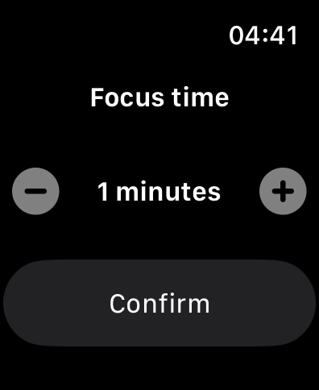
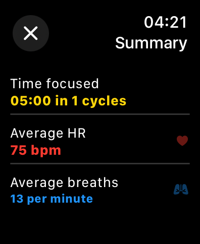

# PulsePomodoro

PulsePomodoro is a Pomodoro app designed specifically for Apple Watch. It helps you stay focused and productive by using the Pomodoro Technique, a time management method that breaks work into intervals, typically 25 minutes in length, separated by short breaks.

## Demonstration

    
    
    

## Installation

1. Clone the repository.
2. Open the project in Xcode.
3. Build and run the app on your Apple Watch.

## Contributing

Contributions are welcome! If you have any ideas, suggestions, or bug reports, please open an issue or submit a pull request.

## License

This project is licensed under the [MIT License](LICENSE).
